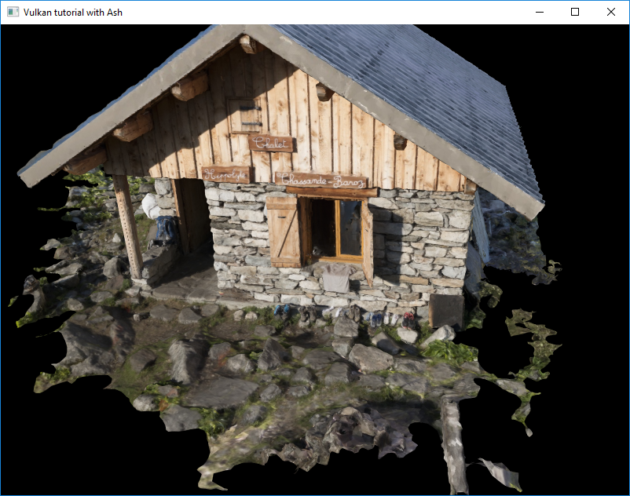
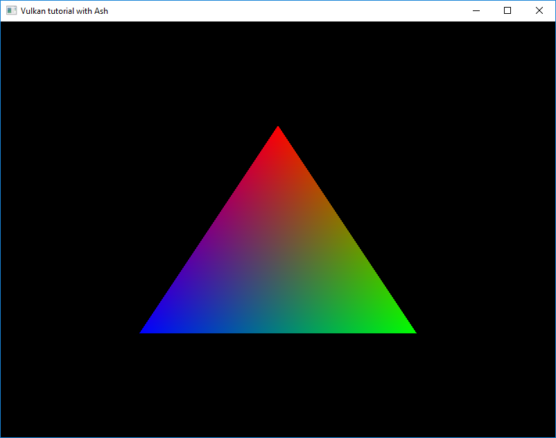
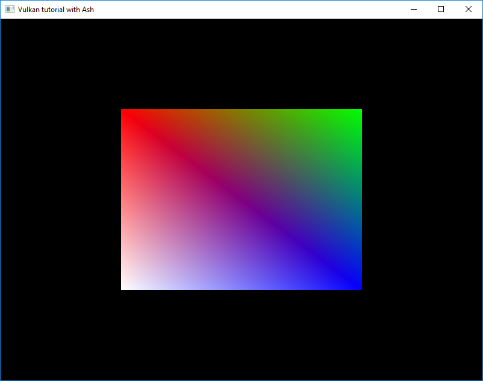
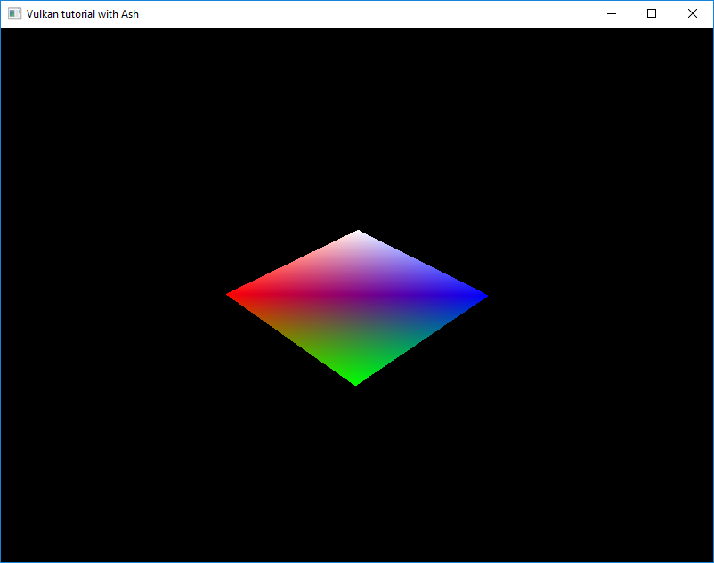
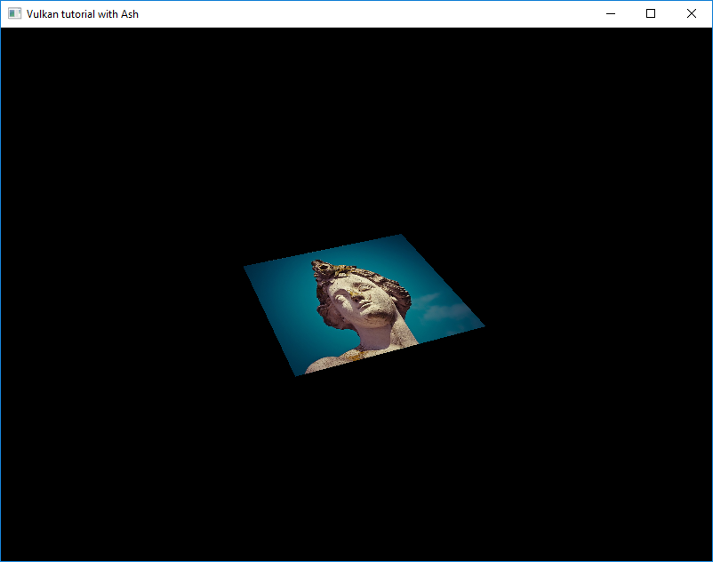
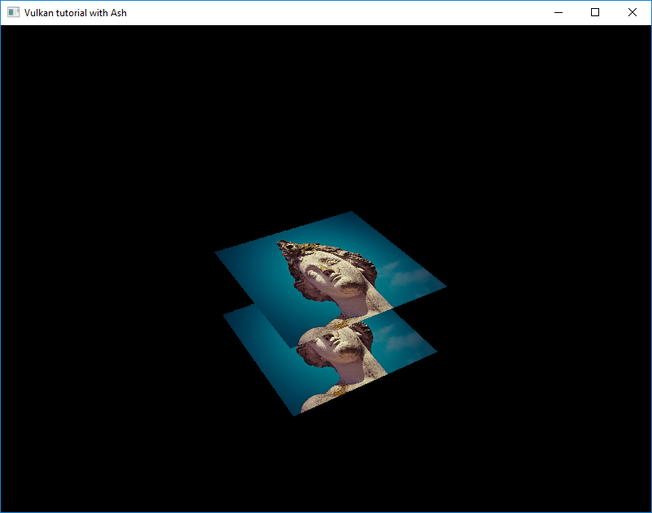

# Vulkan tutorial

![][8]

Vulkan [tutorials][0] written in Rust using [Ash][1]. The [extended][10] branch contains a few more
chapters that I won't merge on that branch since I want it to stay close to the original tutorial.
Please check it out :). If you wan't to run it on android see the [android][11] branch.



## Introduction

This repository will follow the structure of the original tutorial. Each 
commit will correspond to one page or on section of the page for 
long chapters.

Sometimes an 'extra' commit will be added with some refactoring, commenting or feature.

All chapters of the original tutorial are now covered. The code compiles on windows, linux
and macos and runs on windows, and linux. It should also run on macos but I haven't been
able to test yet. I'll update this statement when I (or someone else) can try.

## Requirements

You need to have a [Vulkan SDK][3] installed and  `glslangValidator` executable in your `PATH`. 
This should be the case when installing the Vulkan SDK.

If for some reason you want to skip the shader compilation when buiding the project you can set
the `SKIP_SHADER_COMPILATION` environment variable to `true`. Though you will need to provide the
compiled shaders for the program to run.

## Commits

This section contains the summary of the project commits. Follow :rabbit2: to go to the related 
tutorial page.

### 1.1.1: Base code [:rabbit2:](https://vulkan-tutorial.com/Drawing_a_triangle/Setup/Base_code)

Application setup. We don't setup the window system now as it's done in 
the original tutorial.

### 1.1.2: Instance [:rabbit2:](https://vulkan-tutorial.com/Drawing_a_triangle/Setup/Instance)

Create and destroy the Vulkan instance with required surface extensions.

### 1.1.3: Validation layers [:rabbit2:](https://vulkan-tutorial.com/Drawing_a_triangle/Setup/Validation_layers)

Add `VK_LAYER_LUNARG_standard_validation` at instance creation and creates
a debug report callback function after checking that it is available. 
Since we are using the `log` crate, we log the message with the proper log level.
The callback is detroyed at application termination.

### 1.1.4: Physical devices and queue families [:rabbit2:](https://vulkan-tutorial.com/Drawing_a_triangle/Setup/Physical_devices_and_queue_families)

Find a physical device with at least a queue family supporting graphics.

### 1.1.5: Logical device and queues [:rabbit2:](https://vulkan-tutorial.com/Drawing_a_triangle/Setup/Logical_device_and_queues)

Create the logical device interfacing with the physical device. Then create
the graphics queue from the device.

### 1.1.extra: Refactoring and comments

- Update the readme with explanations on the structure of the repository. 
- Move validation layers related code to its own module.
- Disabled validation layers on release build.

### 1.2.1: Window surface [:rabbit2:](https://vulkan-tutorial.com/Drawing_a_triangle/Presentation/Window_surface)

Create the window, the window surface and the presentation queue.
Update the physical device creation to get a device with presentation support.
At that point, the code will only work on Windows.

### 1.2.2: Swapchain [:rabbit2:](https://vulkan-tutorial.com/Drawing_a_triangle/Presentation/Swap_chain)

Checks for swapchain support and enable device extension for swapchain. Then
query the swapchain details and choose the right settings. Then create the 
swapchain and retrieve the swapchain images.

### 1.2.3: Image views [:rabbit2:](https://vulkan-tutorial.com/Drawing_a_triangle/Presentation/Image_views)

Create the image views to the swapchain images.

### 1.2.extra: Refactoring swapchain creation

Add `SwapchainProperties` to hold the format, present mode and extent of our swapchain.
Add a method to build the best properties to `SwapchainSupportDetails`.
Move these two struct into the `swapchain` module.

### 1.3.2: Shader module [:rabbit2:](https://vulkan-tutorial.com/Drawing_a_triangle/Graphics_pipeline_basics/Shader_modules)

Create the vertex and fragment shaders GLSL source and add a `compile.bat` script
to compile it into SPIR-V bytecode using `glslangValidator`.
Load the compiled SPIR-V and create a `ShaderModule` from it.

In this section I forgot to create the shader stage create info structures. It's ok
they will be created in `1.3.5: Graphics pipeline`.

### 1.3.3: Fixed functions [:rabbit2:](https://vulkan-tutorial.com/Drawing_a_triangle/Graphics_pipeline_basics/Fixed_functions)

This one is huge so it will be split across several commits.

- 1.3.3.1: Vertex input and input assembly

Create the vertex input and input assembly info for the pipeline.

- 1.3.3.2: Viewports and scissors

Create the viewport and scissor info for the pipeline.

- 1.3.3.3: Rasterizer

Create the rasterizer info for the pipeline.

- 1.3.3.4: Multisampling

Create the multisampling info for the pipeline.

- 1.3.3.5: Color blending

Create color blend attachment and color blend info for the pipeline.

- 1.3.3.6: Pipeline layout

Create the pipeline layout info.

### 1.3.4: Render passes [:rabbit2:](https://vulkan-tutorial.com/Drawing_a_triangle/Graphics_pipeline_basics/Render_passes)

Create the render pass.

### 1.3.5: Graphics pipeline [:rabbit2:](https://vulkan-tutorial.com/Drawing_a_triangle/Graphics_pipeline_basics/Conclusion)

Create the `PipelineShaderStageCreateInfo` that we forgot in `1.3.2: Shader module`.

Create the grahics pipeline. 

### 1.3.extra: Shader compilation refactoring

Until now we compiled the shaders with a `compile.bat` script that we have to run 
manually before running the application. In this section, we will compite them
when building the application using [Cargo][2]'s build scripts.

The build script scan the content of the `shaders` directory and generates a compiled
SPIR-V shader for each file it founds. The files are generated in a the same directory
as the GLSL shaders and with the same name appended with `.spv`.

### 1.4.1: Framebuffers [:rabbit2:](https://vulkan-tutorial.com/Drawing_a_triangle/Drawing/Framebuffers)

Create one framebuffer for each image of the swapchain.

### 1.4.2: Command buffers [:rabbit2:](https://vulkan-tutorial.com/Drawing_a_triangle/Drawing/Command_buffers)

Create a command pool and allocate one command buffer per swapchain image.
Then we register all the commands required to render.

### 1.4.3: Rendering and presentation [:rabbit2:](https://vulkan-tutorial.com/Drawing_a_triangle/Drawing/Rendering_and_presentation)

This section is also split across multiple commits.

- 1.4.3.1: Main loop

Setup the main loop.

- 1.4.3.2: Semaphores

Create a semphore to signal that an image has been acquired and another one
to signal that the rendering to the image is finished.

- 1.4.3.3: Rendering the triangle!

Acquire the next image from the swapchain, submit the command buffer and
present the rendered image.



- 1.4.3.4: Frames in flight

Limit the number of frames that can be renderer simultaneously using fences.

### 1.4.extra: Refactoring

- Add `QueueFamilyIndices` structure and return it at physical device creation
to avoid having to recreate it multiple times.
- Add `SyncObjects` containing the semaphores and fence for one frame.
- Add `InFlightFrames` containing all `SyncObjects` and the current frame index.
- Implement `Iterator` for `InFlightFrames` so we just need to call `next()` to
get next frame sync objects.

### 1.5: Swapchain recreation [:rabbit2:](https://vulkan-tutorial.com/Drawing_a_triangle/Swap_chain_recreation)

Handle swapchain recreation when resizing the window or when the swapchain is suboptimal
or out of date.

### 2.1: Vertex input description [:rabbit2:](https://vulkan-tutorial.com/Vertex_buffers/Vertex_input_description)

Remove hard coded vertices from the vertex shader source and create vertices on the cpu.
Update the pipeline with the vertex binding and attributes description.

### 2.2: Vertex buffer creation [:rabbit2:](https://vulkan-tutorial.com/Vertex_buffers/Vertex_buffer_creation)

Create and fill the vertex buffer and bind it before rendering.

### 2.3: Staging buffer [:rabbit2:](https://vulkan-tutorial.com/Vertex_buffers/Staging_buffer)

Create a staging buffer for the vertex data and copy the vertex data from this buffer's
memory to the memory of the device local buffer. 

The tutorial also suggests that we allocate command buffers used for memory copy from
a command pool dedicated to short-lived command buffers, so we did that too.

### 2.4: Index buffer [:rabbit2:](https://vulkan-tutorial.com/Vertex_buffers/Index_buffer)

Use index buffer to reuse vertice when drawing a rectangle.

In the original tutorial the `create_index_buffer` is the same as `create_vertex_buffer`
but with the vertex data replaced with the index data. To limit duplication we've added
a method that creates and fill a buffer and fill it with the passed data. This method is
called from `create_vertex_buffer` and `create_index_buffer`.



### 3.1: Descriptor layout and buffer [:rabbit2:](https://vulkan-tutorial.com/Uniform_buffers/Descriptor_layout_and_buffer)

Create a `UniformBufferObject` structure containing transformation matrices and create the
descriptor layout and buffers used to make it accessible from the vertex shader.

Also add a `math` module containing a `perspective` function that creates a prespective matrix
that is working with Vulkan's NDC. 

### 3.2: Descriptor pool and sets [:rabbit2:](https://vulkan-tutorial.com/Uniform_buffers/Descriptor_pool_and_sets)

Create a descriptor pool and allocate a descriptor set for each descriptor buffer.



### 4.1: Images [:rabbit2:](https://vulkan-tutorial.com/Texture_mapping/Images)

This section is split too.

- 4.1.1: Loading an image

Load an image from a file.

- 4.1.2: Creating the image

Create an host visible staging buffer for image data and create a device local
image. At this point the image is empty, we will copy the buffer data in a later
section.

- 4.1.3: Copying buffer data into the image

Copy the image data store in the host visible buffer to the device local image.

### 4.2: Image view and sampler [:rabbit2:](https://vulkan-tutorial.com/Texture_mapping/Image_view_and_sampler)

Create the image view and sampler. Also enable the sampler anisotropy feature.

### 4.3: Combined image sampler [:rabbit2:](https://vulkan-tutorial.com/Texture_mapping/Combined_image_sampler)

Update the descriptor set, add texture coordinates to `Vertex` and update the 
shaders to read texture coordinates and sample the texture.



### 5: Depth buffering [:rabbit2:](https://vulkan-tutorial.com/Depth_buffering)

 Update `Vertex` to make the position 3d. Update the vertex shader to take the
 new dimension into account. Add a new quad to render. And setup depth buffer
 so the new quad is renderer correctly relatively to the other. Recreate the
 depth buffer resources when the swapchain is recreated.



### 5.extra: Refactoring

 Add `Texture` struct which will hold the resources required by mutable image,
 (image, memory, view and optionnally a sampler).

 Add `VkContext` that will hold the instance, debug callback, physical and logical
 devices, and surface.

 Overall refactoring of the code with some Rust specific code smell fixes.

### 6: Loading models [:rabbit2:](https://vulkan-tutorial.com/Loading_models)

 Load a 3D model from an wavefront obj file and render it. We skip the deduplication
 step because the crate we use to load obj files already does it.

### 6.extra: Orbital camera

Since `3.1: Descriptor layout and buffer`, our rendered geometry has been spinning
infinitely around its local z axis. In this chapter we change this behaviour and
implement an orbital camera controlled with the mouse.

You can scroll the mouse wheel to get closer or further away from the global origin.
And you can left click and move the mouse to move around the global origin.

### 7: Generating mpimaps [:rabbit2:](https://vulkan-tutorial.com/Generating_Mipmaps)

Generate mipmaps for the model texture and update the sampler to make use of them.

### 8: Multisampling [:rabbit2:](https://vulkan-tutorial.com/Multisampling)

Add multisampling anti-aliasing.


## Run it

With validation layers:

```sh
RUST_LOG=vulkan_tutorial_ash=debug cargo run
```

> The RUST_LOG level will affect the log level of the validation layers too.

or without:

```sh
cargo run --release
```

## Links

[Vulkan tutotial][0]

[Ash][1]

[Rust docs][4]

[Cargo docs][2]

[Vulkan SDK][3]

[Vulkan specs][5]

[The image statue][6]

[The 3D model][7]

## Credits

Thanks to Alexander Overvoorde for this amazing tutorials.

[0]: https://vulkan-tutorial.com/Introduction
[1]: https://github.com/MaikKlein/ash
[2]: https://doc.rust-lang.org/cargo
[3]: https://www.lunarg.com/vulkan-sdk
[4]: https://doc.rust-lang.org/
[5]: https://www.khronos.org/registry/vulkan/specs/1.1/html/
[6]: https://pixabay.com/en/statue-sculpture-figure-1275469/
[7]: https://sketchfab.com/3d-models/chalet-hippolyte-chassande-baroz-e925320e1d5744d9ae661aeff61e7aef
[8]: https://github.com/adrien-ben/vulkan-tutorial-rs/workflows/Cross-platform%20build/badge.svg
[10]: https://github.com/adrien-ben/vulkan-tutorial-rs/tree/extended
[11]: https://github.com/adrien-ben/vulkan-tutorial-rs/tree/android
